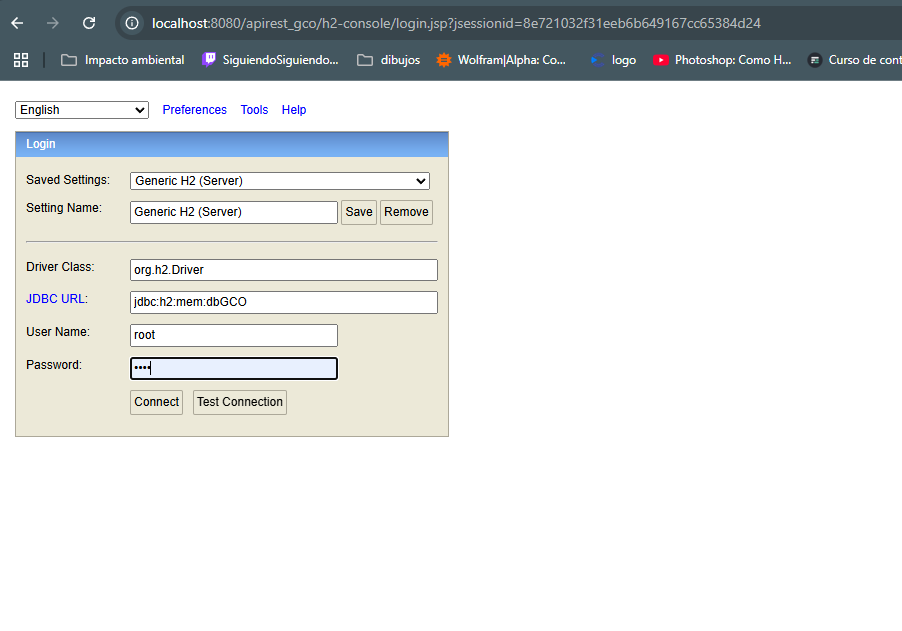
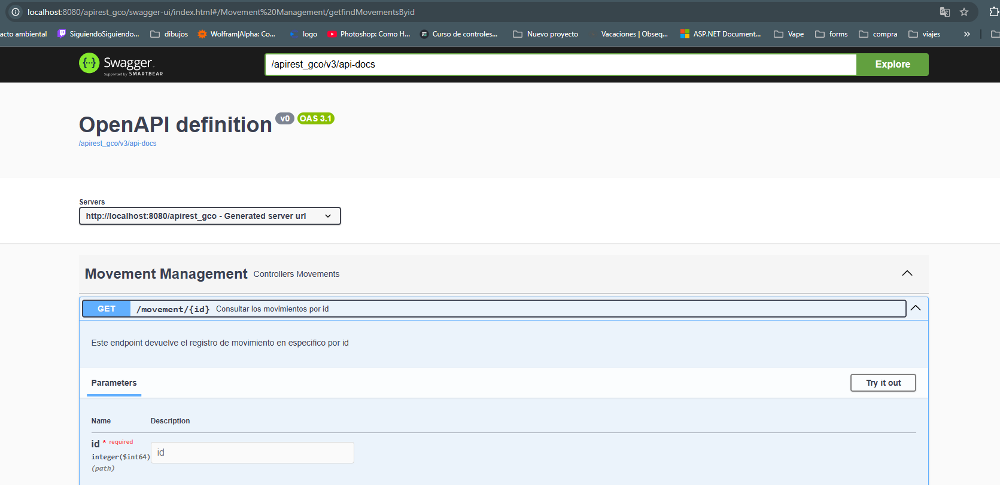

# API Rest GCO

Este proyecto usa [Spring boot](https://spring.io/projects/spring-boot) version 3.4.6

* El proyecto se ejecuta en el puerto `Port= 8080`
* Se modifica la Url de la api para consumir la información con el sigiuiente comando   
    * `server.servlet.context-path=/apirest_gco`
    * Ejemplo: `localhost:8080/apirest_gco`

## Base de datos

Se crea conexion a base de datos H2 con la siguiente configuración

En el archivo `pom.xml` se agrega el siguiente código
```bash
<dependency>
    <groupId>com.h2database</groupId>
    <artifactId>h2</artifactId>
    <scope>runtime</scope>
</dependency>
```
En el archivo `application.properties` se agrega el siguiente código
```bash
spring.application.name=apirest_gco
spring.h2.console.enabled=true
spring.datasource.url=jdbc:h2:mem:dbGCO
spring.datasource.driver-class-name=org.h2.Driver
spring.datasource.username=root
spring.datasource.password=1234
spring.jpa.database-platform=org.hibernate.dialect.H2Dialect
```


* El nombre de la base de datos es  `dbGCO`.
* La Url para ingresar a la base de dato es `http://localhost:8080/apirest_gco/h2-console`
    * Usuario: root
    * Contraseña: 1234



## Documentacion api


Se crea la documentación de la API implementando Swagger.
* Url: (http://localhost:8080/apirest_gco/swagger-ui/index.html)

* En el archivo `pom.xml` se agrega el siguiente código
```bash
<dependency>
    <groupId>org.springdoc</groupId>
    <artifactId>springdoc-openapi-ui</artifactId>
    <version>1.7.0</version> 
</dependency>
```

* En los controladores se agrega la siguiente codificacion para documentarla 
```bash
@RestController
@RequestMapping("/movement")
@CrossOrigin(origins = "http://localhost:4200")
@Tag(name = "Gestión de movimientos", description = "Controlador de Movimientos")
```
* Tambien se agrega a cada uno de los Endpoin la siguiente codificacion
```bash
   @Operation(summary = "Consultar los movimientos del producto por id", description = "Este endpoint devuelve los registro de movimiento de un producto en especifico por id")
    @ApiResponses(value = {
            @ApiResponse(responseCode = "200", description = "Movimiento consultado", content = @Content(schema = @Schema(implementation = ProductsModel.class))),
            @ApiResponse(responseCode = "400", description = "Datos de solicitud no válidos", content = @Content(schema = @Schema())),
            @ApiResponse(responseCode = "500", description = "Error interno del servidor")
    })
    @GetMapping(value = "/product/{idproducto}")
```

